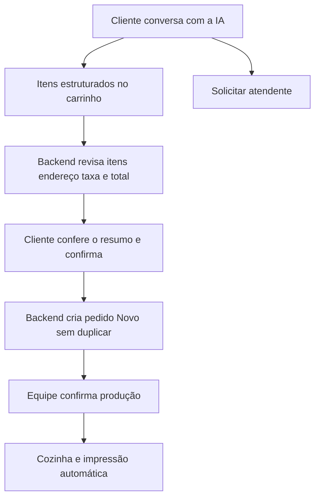

# Prontidão do Made in Minas para integração com IA

O sistema tem a base operacional necessária para iniciar a Fase 9 em ambiente de teste: catálogo, revisão de compras, pedidos, estoque, atendimento humano, produção, entrega e impressão. Os serviços existentes podem fornecer dados e validar as operações da IA. A liberação para clientes depende de completar as regras de atendimento e implementar controle da conversa, ferramentas autorizadas, recuperação de falhas e avaliação das respostas.

A primeira entrega recomendada é um assistente no chat próprio que consulta o cardápio atual, informa as condições de entrega e retirada e encaminha dúvidas ao atendente. A criação de pedidos pela conversa entra em um incremento seguinte, com revisão calculada pelo backend e confirmação explícita do cliente. Essa sequência considera o atendimento ao cliente como prioridade inicial da Fase 9; análises administrativas de vendas e estoque terão permissões e critérios próprios.

Diagnóstico de 08/10/2026, baseado no código da branch `fix/thermal-print-height`, commit local `9e78e2b`, nos contratos da API e nas consultas somente leitura da instalação local. Esse commit registra impressão automática e sirene de pedidos. Publicação da branch, integração na master e execução remota da CI são atividades posteriores.

## Situação das funcionalidades

“Implementado” descreve o escopo presente no código. Aceite de uma funcionalidade não comprova toda a operação em produção.

| Área                        | Implementação atual                                                                                                       | Preparação para IA e pendências                                                                                                                            |
| --------------------------- | ------------------------------------------------------------------------------------------------------------------------- | ---------------------------------------------------------------------------------------------------------------------------------------------------------- |
| Autenticação e funcionários | Login, perfis, permissões, bloqueio de tentativas, revogação e gestão de contas. JWT da equipe em memória por 15 minutos. | Reutilizar autorização do servidor. A IA do cliente precisa de capacidades limitadas à conversa, sem credencial de administrador.                          |
| Categorias e produtos       | Cadastro, preço, descrição, ativação e pausa de venda.                                                                    | Fonte comercial para as respostas; conferir se todos os produtos reais estão cadastrados.                                                                  |
| Fotos próprias              | Upload, substituição, remoção e conversão para WebP; consulta pública.                                                    | Mostrar as mesmas fotos nos cards do chat. Incluir armazenamento de imagens no backup da hospedagem.                                                       |
| Ingredientes e fichas       | Unidade, custos, composição, rendimento e instruções.                                                                     | Sustentam disponibilidade. Informações comerciais de ingredientes e alergênicos precisam de conteúdo conferido para responder ao cliente.                  |
| Estoque e reposição         | Entradas, saídas, contagem, versões, histórico, baixa na confirmação e devolução conforme a etapa.                        | Preservar essas regras; pedidos Novos não reservam saldo. Saldo suficiente na consulta não garante disponibilidade no envio ou na confirmação.             |
| CMV                         | Custo e margem teóricos por produto, com sinalização de ficha/custo incompletos.                                          | Útil a um assistente administrativo. Custo histórico das vendas, despesas e lucro realizado ainda exigem módulos próprios.                                 |
| Clientes e endereços        | Cadastro administrativo e contato/endereço públicos copiados no pedido.                                                   | Telefone informado pelo visitante não comprova identidade; a IA não pode consultar o histórico de alguém apenas pelo telefone.                             |
| Cardápio público            | Produtos, fotos, busca e disponibilidade por categoria, produto, ficha e saldo.                                           | Reutilizar a projeção pública, sem expor receitas internas, custos ou saldos.                                                                              |
| Carrinhos                   | Montagem e recuperação na aba; revisão de itens e valores pelo backend.                                                   | Falta vincular uma seleção estruturada à conversa, caso a IA monte a compra.                                                                               |
| Checkout público            | Nome, telefone, modalidade, endereço, revisão, revalidação e repetição idempotente.                                       | Reutilizar o fluxo. Ainda não recebe preferência de pagamento ou troco do cliente.                                                                         |
| Entrega e retirada          | Corinto/MG, todos os bairros, entrega R$ 5,00 e retirada gratuita na Rua Esperança, 68, Clarindo de Paiva.                | Regras estão na API. Falta configuração de horários, loja aberta/pausada e orientações comerciais de prazo.                                                |
| Pedidos                     | Entidade central, numeração, origem, cópias comerciais, filtros e histórico versionado.                                   | Compra criada deve continuar em Novo para confirmação da equipe. Registrar vínculo com a conversa e atribuição do assistente.                              |
| Pagamentos                  | Dinheiro, Pix, crédito/débito; registro manual de recebimento e devolução, com histórico.                                 | A IA pode explicar opções confirmadas pela operação. Recebimento depende da conferência da equipe; cobrança bancária ainda não está integrada.             |
| Cozinha                     | Confirmados, em preparação e prontos, com dados restritos à produção.                                                     | Reutilizar sem dar à IA do cliente poderes de avanço da cozinha.                                                                                           |
| Expedição                   | Fluxo de entrega/retirada, versões e finalização condicionada ao recebimento integral.                                    | Consultar apenas o status autorizado para o cliente; acompanhamento do entregador e localização não estão implementados.                                   |
| Impressão                   | Comandas 58/80 mm e A4, fila persistente, envio direto e agente Windows.                                                  | Já acompanha confirmação e Pronto. Para continuidade após reinício do Windows, falta configurar início automático do agente; hoje existe iniciador manual. |
| Avisos de pedidos           | Contador, atualização a cada 10 segundos e sirene opcional.                                                               | Som funciona na tela Pedidos com a aba visível; aviso global ou em segundo plano é uma melhoria operacional.                                               |
| Acompanhamento público      | Credencial exclusiva do pedido, status e histórico restrito; recuperação de comprovantes.                                 | Base para consulta de status pela IA, após validar o acesso. Número de pedido isolado não autoriza consulta.                                               |
| Atendimento humano          | Conversas, fila, responsável, mensagens, encerramento e recuperação sem duplicação.                                       | Falta autoria de assistente, controle IA/humano, estado de resposta em andamento e vínculo autorizado ao pedido.                                           |
| Dashboard e relatórios      | Indicadores diários e por período, vendas, recebimentos, devoluções e ranking.                                            | Reutilizáveis por assistente administrativo separado. A amostra local é insuficiente para validar previsões de demanda.                                    |
| Qualidade e infraestrutura  | Testes da API e interface, migrations, health checks e CI; configuração local.                                            | Hospedagem pública exige domínio/TLS, proxy confiável, backups/restauração, chaves persistentes e monitoramento.                                           |

Contratos e regras: [API](api.md), [autenticação](authentication.md), [produtos](products.md), [estoque por pedido](order-stock.md), [checkout](public-checkout.md), [entrega](public-delivery.md), [pagamentos](payments.md), [atendimento humano](human-chat.md), [impressão automática](automatic-printing.md) e [arquitetura](architecture.md).

## Dados disponíveis na instalação local

Na consulta de 08/10/2026, o banco `made_in_minas` apresentou:

- Um produto ativo, com descrição, imagem e ficha; uma ficha e um ingrediente ativo. O ingrediente tem custo e movimentação registrados e saldo acima do mínimo. Esses preenchimentos precisam representar os ingredientes e valores reais antes de orientar compras pela IA.
- Onze pedidos, oito de origem pública; dois registros de pagamento. Esses números são cadastros e eventos locais, sem estabelecer faturamento, encerramento financeiro ou volume de vendas reais.
- Uma conversa aberta. A existência dessa conversa valida a persistência do atendimento, sem demonstrar a integração com IA.
- Impressão automática ativa, estação conectada, cinco trabalhos na fila histórica e zero com estado Review. Envio ao spooler e saída física são resultados distintos; o responsável já relatou funcionamento da impressão automática.
- Migration mais recente `20261008035011_AddPrintQueue`. As opções públicas confirmaram a taxa de R$ 5,00, retirada grátis, endereço e cobertura de todos os bairros de Corinto/MG; o cardápio retornou um produto disponível.

Uma oferta comercial com um único produto pode ser válida. A operação precisa confirmar se esse cadastro é o cardápio completo pretendido. A IA deve oferecer apenas os produtos consultados e tratar ausência de informação como dúvida para o atendente.

## Pendências que condicionam a liberação da IA

| Prioridade e momento             | Pendência                      | Entrega verificável                                                                                                                                                                                           |
| -------------------------------- | ------------------------------ | ------------------------------------------------------------------------------------------------------------------------------------------------------------------------------------------------------------- |
| Antes do piloto com clientes     | Regras de atendimento          | Horários/dias, abertura e pausa manual, modalidades disponíveis, preferência de pagamento, orientação de prazo e perguntas frequentes conferidos pela operação. Informações ausentes encaminham ao atendente. |
| Fase 9A                          | Autoria e controle da conversa | Mensagem identificada como Assistente virtual; modo IA/humano; solicitar e assumir atendimento; interrupção de respostas antigas; opção administrativa de desligar IA.                                        |
| Fase 9B                          | Acesso ao modelo e dados reais | Provedor/modelo configuráveis no backend, segredo protegido, limite de custo, timeout, ferramentas com argumentos validados e consultas atuais de cardápio/regras.                                            |
| Antes de criar pedidos pelo chat | Carrinho e autorização         | Seleção persistente vinculada à conversa; resumo atualizado; acesso verificado ao pedido; confirmação explícita; mesma tentativa preservada após timeout/reload.                                              |
| Antes do piloto com clientes     | Recuperação e avaliação        | Indisponibilidade do modelo encaminha ao humano; concorrência e reenvios testados; bateria de diálogos reais e adversos; registro de falhas, latência, uso e custo.                                           |
| Antes da exposição pública       | Hospedagem e dados             | HTTPS/domínio, proxy e IP confiáveis, API/agente disponíveis, banco/imagens/chaves com backup recuperável, política de retenção e envio mínimo de dados ao provedor.                                          |

Horário da loja é uma regra comercial do servidor. Exibi-lo no texto de instrução da IA não impede que o checkout aceite uma compra fora do horário; o backend precisa aplicar a regra definida para esse caso. Um prazo deve ter origem operacional explícita e distinguir estimativa de garantia.

Não há catálogo estruturado de combos, adicionais, substituições ou alergênicos. Observações livres atuais não alteram preço nem a composição baixada no estoque. No primeiro piloto, a IA deve orientar as opções existentes e encaminhar personalizações não suportadas; oferecer adicionais com preço exige implementar também catálogo, revisão, estoque e comanda correspondentes. Respostas sobre alergênicos exigem conteúdo conferido e encaminhamento de dúvidas à equipe.

## Alterações necessárias no chat e no backend

O modelo atual de [conversa](../backend/MadeInMinas.Api/Models/ChatConversation.cs) registra Waiting, InService e Closed, com responsável humano. A [constraint de mensagens](../backend/MadeInMinas.Api/Data/Configurations/ChatMessageConfiguration.cs) admite Visitor, Staff e System. Uma resposta de IA exige contratos e migration para autoria própria, além de estados e controle de responsável compatíveis com o atendimento humano. A interface deverá distinguir assistente e atendente.

O [compartilhamento atual](../frontend/made-in-minas/src/app/features/chat/public-chat.page.ts) preenche uma mensagem com o número do pedido. Para consultar status ou agir sobre a compra, criar vínculo no servidor validando o acesso à conversa e a credencial do pedido. Credenciais ficam no servidor/cabeçalhos e são omitidas do conteúdo enviado ao modelo. O vínculo não amplia automaticamente os dados públicos de acompanhamento.

A geração de resposta deve ter identificação persistente por mensagem de entrada, controle de processamento e recuperação após reinício. Evitar manter transação ou bloqueio de conversa aberto durante a chamada externa ao modelo. Antes de salvar a resposta, conferir novamente modo, versão e responsável; uma resposta antiga não pode aparecer depois que um atendente assumiu. Reenvio e recuperação não geram outra resposta nem outro pedido para a mesma tentativa.

Para a primeira implementação, um serviço de IA no monólito e um worker com registro de execução no PostgreSQL são suficientes como desenho inicial. A fila de impressão já demonstra o padrão de trabalho persistente e resultado incerto. Dimensionamento de infraestrutura adicional depende de volume medido; a interface pode continuar consultando o histórico existente.

## Ferramentas e confirmação da compra

O modelo pede operações com argumentos estruturados; a aplicação escolhe quais solicitações podem ser executadas e usa os serviços existentes. Esse mecanismo é descrito pela [documentação de ferramentas de IA do .NET](https://learn.microsoft.com/en-us/dotnet/ai/conceptual/calling-tools). O catálogo pequeno e estruturado permite começar com consultas diretas à API; busca vetorial e treinamento de modelo próprio não são pré-requisitos identificados para esse escopo.

| Ferramenta proposta           | Fonte e condição                                                                                                                                              |
| ----------------------------- | ------------------------------------------------------------------------------------------------------------------------------------------------------------- |
| Consultar cardápio            | PublicMenuService: produtos públicos, preços e disponibilidade atuais.                                                                                        |
| Consultar condições da loja   | DeliverySettingsService e futura configuração de horários/atendimento.                                                                                        |
| Consultar pedido              | PublicOrderTrackingService, somente com acesso validado ao pedido da conversa.                                                                                |
| Solicitar atendente           | Controle versionado da conversa; interrompe a atuação da IA.                                                                                                  |
| Propor itens e revisar compra | Fluxo estruturado, PublicCartService e PublicCheckoutService; nenhuma criação nessa consulta.                                                                 |
| Enviar compra confirmada      | Backend comprova confirmação da revisão atual, gera/preserva requestId e usa a criação idempotente do checkout. Disponível no incremento de compra pelo chat. |

Argumentos, identificadores de produtos, quantidades e escopo de acesso são validados pelo backend. O modelo do atendimento público não recebe ferramentas para alterar preços, estoque, pagamentos, cozinha ou dados administrativos. Essa escolha aplica a recomendação de limitar funcionalidades, permissões e autonomia e verificar autorização fora do modelo, conforme a [OWASP sobre autonomia excessiva](https://genai.owasp.org/llmrisk/llm062025-excessive-agency/).

Fluxo proposto para a compra pelo chat:

O resumo deve mostrar itens, quantidades, observações, modalidade, endereço quando houver entrega, taxa e total. Editar a seleção exige nova revisão. Um “sim” sem associação à revisão atual não autoriza uma compra. O modelo não gera preços ou totais e não transforma a criação do pedido em confirmação de preparo ou recebimento de pagamento.

## Melhorias de fluxo e layout para o atendimento com IA

- No cliente, manter conversa e resumo do carrinho juntos no computador e oferecer alternância clara no celular. Produto sugerido vira card com foto, preço consultado e ação de adicionar; resumo da compra permanece acessível.
- Mostrar Assistente virtual, Atendente ou Aguardando atendente, além de estado de resposta em andamento, falha e opção de tentar novamente sem duplicar envio.
- Oferecer Falar com atendente durante a conversa e explicar quando a compra ainda é uma seleção, quando foi enviada e quando a equipe confirmou o preparo.
- Na equipe, identificar conversas sob IA, pedidos de intervenção e atendimentos assumidos. Abrir pedido e resumo autorizado a partir da conversa deve substituir a busca manual pelo número citado.
- Em Gestão, incluir ativação da IA, revisão das informações da loja e acompanhamento de custos, falhas e encaminhamentos, com permissão administrativa.
- Na operação, configurar início automático do agente de impressão e avaliar avisos gerais de novos pedidos/conversas. Esses ajustes ajudam a continuidade, mas têm escopo independente das respostas da IA.

## Sequência recomendada para a Fase 9

1. **9A Preparação do atendimento.** Conferir catálogo e regras reais; definir horários/abertura, informações comerciais, autoria do assistente, controle de modo, intervenção humana e desligamento. Testar concorrência e cancelamento de respostas.
2. **9B Assistente de consulta em piloto.** Integrar provedor no backend, ferramentas de leitura e solicitação de atendente. Configurar timeout, recuperação, histórico limitado, registro de uso/custo e conjunto de avaliação. O cliente conclui a compra pelo carrinho/checkout existentes.
3. **9C Compra assistida.** Vincular carrinho/conversa, resolver produtos ambíguos, apresentar revisão estruturada e permitir envio confirmado, sem alterar as regras de confirmação da equipe. Acrescentar preferência de pagamento/troco se essa coleta fizer parte do escopo aprovado.
4. **9D Liberação controlada.** Executar diálogos de operação, ensaio de falha/reinício, observar erros/custos e liberar um público limitado. Manter retorno ao humano e desligamento disponíveis. Hospedagem pública precisa estar preparada antes dessa exposição.

Combos/adicionais, cobrança online, WhatsApp, rastreamento de entregador, CMV realizado e previsões de demanda são evoluções separadas. Tornam-se dependências quando a função prometida ao cliente ou à gestão exige esses dados. O [roadmap](roadmap.md) e os trechos históricos do README ainda precisam incorporar as entregas recentes de fotos, cobertura de Corinto e impressão automática.

## Critérios de aceite da IA

O piloto deve demonstrar respostas corretas para cardápio/preços, produto indisponível, entrega/retirada, loja fechada e dados comerciais ausentes. Também deve demonstrar:

- Pedido ambíguo solicita esclarecimento; produto inexistente, promoção não cadastrada e personalização sem suporte não são inventados.
- Consulta de pedido sem credencial é recusada; troca entre conversas não compartilha histórico, carrinho ou dados pessoais.
- Mensagens tentando alterar instruções ou obter dados internos não ampliam ferramentas nem permissões.
- Atendente assume durante uma geração e a resposta antiga é descartada; falha/timeout do provedor encaminha ao humano.
- Limites de mensagens, ferramentas, uso e custo encerram a execução de forma compreensível, preservando a conversa.
- Compra só é enviada após confirmação do resumo atual; preço/estoque/cobertura alterados exigem revisão; resposta perdida e reinício conservam a tentativa sem duplicar compra.
- Conversa, pedido, produção, impressão e pagamento mantêm autor, sequência e regras comerciais. A IA não registra um recebimento a partir de uma afirmação livre do cliente.

Os testes existentes verificam os fluxos determinísticos. A nova etapa precisa acrescentar avaliação da IA com perguntas e resultados esperados, medir respostas inadequadas e registrar latência, consumo e encaminhamento. Modelo e limite de custo devem ser escolhidos com essa amostra; o diagnóstico não fixa fornecedor, preço ou modelo sem essa decisão.

## Validação desta revisão

- **593/593 testes da API aprovados**, em execução integral de `scripts/Test-Authentication.ps1`, com PostgreSQL temporário isolado em `127.0.0.1:55433`, encerrado pelo helper ao concluir. A suíte inclui autenticação, catálogo, clientes, pedidos, estoque, pagamentos, produção, expedição, relatórios, checkout, atendimento e impressão. Saída em `.local/ai-readiness-backend.log` e relatório em `.local/auth-test-results/results.trx`.
- **32/32 cenários principais de navegador aprovados**, no Edge com apresentação de computador/celular, selecionando `human-chat.spec.ts`, `public-checkout.spec.ts`, `kitchen.spec.ts`, `dispatch-printing.spec.ts` e `printing-automation.spec.ts`. Incluem atendimento e autoria, recuperação sem duplicação, concorrência, pedido público com entrega, autorização, cozinha, pagamento bloqueando finalização e automação da impressão. APIs simuladas; essa seleção não representa execução de toda a suíte frontend.
- **9/9 verificações locais aprovadas** por `scripts/Test-Foundation.ps1 -ExpectDatabaseReady`: saúde da API e banco, contrato de status, CORS, erros, OpenAPI de desenvolvimento e frontend disponível. Opções públicas e cardápio também consultados diretamente.
- Build de produção Angular, lint e oito testes de áudio já aprovados para o código com sirene registrado no commit `9e78e2b`. A análise posterior acrescenta apenas este documento.
- Consultas de cadastro e configuração executadas somente em leitura no banco `made_in_minas`, sem dados pessoais no relatório. Nenhum teste gravou pedidos na operação. As contagens são um retrato da consulta e podem mudar com o uso do sistema.

Essas verificações sustentam o início do desenvolvimento da IA. Publicação e operação contínua exigem os critérios de hospedagem e piloto descritos acima; a revisão local não substitui ensaio com o modelo escolhido e a equipe.
