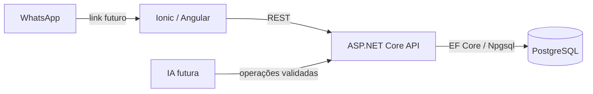

# Arquitetura

Monólito modular, com uma API ASP.NET Core, um frontend Ionic/Angular e PostgreSQL.

## Backend

Controllers expõem HTTP, DTOs definem contratos e Services concentram regras de negócio. O AppDbContext concentra o acesso ao banco. Configurações de entidades ficam em Data/Configurations e migrations em Data/Migrations.

A Fase 2A adiciona AuthController, RolesController, DTOs de autenticação, serviços de login/bootstrap, políticas e validação JWT. Users e Roles são persistidos pelo AppDbContext. Não há repository genérico, múltiplos projetos de domínio, CQRS ou barramento.

Erros não tratados passam pelo exception handler e ProblemDetails. Respostas vazias de erro recebem ProblemDetails. Logs usam a infraestrutura do ASP.NET Core, sem habilitar dados sensíveis do EF.

## Frontend

Componentes standalone e carregamento de página por rota. Core contém serviços HTTP, contratos, sessão, guards e interceptor. Features agrupa página pública, autenticação e equipe; Shared será criado quando houver componentes reutilizáveis.

O serviço SystemApiService usa uma URL por ambiente e timeout de cinco segundos. A tela inicial trata conexão em andamento, sucesso e indisponibilidade, oferecendo nova tentativa.

Desenvolvimento usa origens distintas (8101 e 5080) com CORS restrito. Produção assume mesmo domínio e API em /api. CORS não substitui autenticação.

A Fase 2C mantém JWT em memória, sem persistência/refresh token. O interceptor limita o envio de credenciais à API configurada. Guards controlam a navegação; permissões são validadas também no backend. RouterOutlet Angular destrói páginas na navegação, evitando cache de dados administrativos entre sessões; contêineres de página mantêm a classe ion-page para o layout Ionic. Detalhes em [staff-frontend.md](staff-frontend.md).

## Evolução

Autenticação e autorização de funcionários já existem no backend. Cliente público e funcionário serão identidades distintas. Preços, permissões, status e totais serão definidos pelo backend. Integrações de IA ficarão atrás de contratos introduzidos quando esse módulo for implementado.

JWT foi introduzido na Fase 2A; gestão de usuários, na Fase 2B; login e administração no frontend, na Fase 2C. KDS, expedição e impressão pelo navegador foram adicionados na Fase 5. Impressão automática, integrações bancárias e infraestrutura de produção seguem para incrementos posteriores.

A Fase 3A introduz CategoriesController, DTOs, CategoryService, configuração EF e migration AddCategories, com páginas em features/catalog. catalog.manage separa administração de catálogo da gestão de funcionários. Não há novo repository nem camada adicional; regras e testes constam em [categories.md](categories.md).

A Fase 3B mantém esse padrão para Products, vinculados por FK a Categories. Preços usam decimal/numeric(8,2) com validação anterior à persistência. A disponibilidade efetiva é derivada no backend; a imagem é uma URL HTTPS opcional, sem serviço de upload neste incremento. Os seletores percorrem a lista paginada de categorias. Regras: [products.md](products.md).

A Fase 3C adiciona Ingredients no mesmo padrão, com unidade-base fixa, custo decimal, mínimo e fornecedor textual. Não há relação com Products até a implementação das fichas técnicas. Saldo e movimentos de estoque serão introduzidos na fase 6. Regras e arquivos: [ingredients.md](ingredients.md).

A Fase 3D liga Products e Ingredients por Recipes (uma por produto) e RecipeItems (composição ordenada). RecipeService valida e salva a composição completa em transação, serializando por produto e bloqueando os ingredientes durante a validação. A interface é acessada no produto e carrega os ingredientes de todas as páginas. Não adiciona bibliotecas, repositories, cálculo financeiro ou movimentação de estoque. Detalhes: [recipes.md](recipes.md).

A Fase 4A adiciona CustomersController, CustomerService, contratos, validação de telefone, configurações EF e páginas em features/customers. Customers e Addresses têm status independentes e escrita transacional. A permissão customers.manage inclui atendente; o catálogo continua exclusivo do administrador. A API não autentica clientes por telefone. Detalhes: [customers.md](customers.md).

A Fase 4B adiciona CartController, CartService e DTOs de consulta/revisão, sem novas entidades. O carrinho pertence à página Angular e usa a permissão existente orders.manage. O backend calcula valores em decimal com leituras AsNoTracking em transação RepeatableRead, sem reservar preço/disponibilidade. A futura confirmação deve revalidar os dados e gravar cópias históricas na mesma transação do pedido. Detalhes: [cart.md](cart.md).

A Fase 4C persiste Orders, OrderItems e OrderStatusHistory pelo OrderService, com cópias comerciais, numeração, idempotência e transições versionadas. A Fase 4D adiciona PaymentService, Payments e PaymentStatusHistory no mesmo padrão, sem novas dependências. Pagamentos são manuais e independentes da produção; o bloqueio transacional do pedido coordena gravações de pagamento e cancelamento. A página em features/payments é acessada pelo detalhe do pedido e mantém apenas em memória a tentativa com resultado incerto. Detalhes: [orders.md](orders.md) e [payments.md](payments.md).

A Fase 5A adiciona KitchenController, KitchenService e DTOs próprios sob /api/kitchen/orders, reutilizando a política kitchen.work. A projeção EF seleciona somente campos de produção, e o painel inteiro é lido em RepeatableRead. Avanços usam o mesmo bloqueio de pedido e histórico existente, coordenando cancelamentos e pagamentos. O Angular consulta a cada 10 segundos, sem bibliotecas de tempo real adicionais; requisições e timers terminam com a página. Expedição e impressão permanecem separadas. Detalhes: [kitchen.md](kitchen.md).

As Fases 5B/5C acrescentam DispatchService/DispatchController e PrintController, reaproveitando Orders, OrderStatusHistory e pagamentos, sem entidades de entrega/impressão. A expedição lê pedidos/pagamentos em snapshot e grava usando o mesmo bloqueio de pedido; impressão é somente leitura, com projeções e permissões distintas para produção e expedição. A prévia fora do layout IonContent evita cortes por rolagem na impressão. Integração automática com equipamento não é simulada; depende de configuração e validação próprias. Detalhes: [dispatch-printing.md](dispatch-printing.md).

A Fase 6A introduz StockController, StockService, DTOs e StockMovements, com saldo/versão no ingrediente. Mantém catalog.manage (administrador), transações e bloqueios existentes, sem repositories ou novas dependências. Leitura usa snapshot; escrita atualiza saldo e histórico atomicamente, com versão e idempotência. A página features/stock é acessada pelo ingrediente. Detalhes: [estoque manual](stock.md).

A Fase 6B acrescenta OrderStockService na transação de OrderService e OrderStockComponents como composição histórica. StockMovements recebe OrderId opcional. Confirmação baixa ingredientes com bloqueios ordenados; cancelamento antes do preparo devolve o consumo original. Detalhes de pedido usam RepeatableRead e consultas separadas para coleções; a UI exibe o resultado sem calcular baixas. Nenhuma nova dependência. Ver [consumo por pedidos](order-stock.md).

A Fase 6C acrescenta ProductCostsController, ProductCostService e DTOs/Costing. Consulta administrativa somente leitura, com RepeatableRead e cálculo decimal no backend. A página de CMV usa catalogGuard e uma resposta única para composição/indicadores. Sem entidades, migrations ou dependências novas. Ver [cmv.md](cmv.md).

A Fase 7A acrescenta DashboardController, DashboardService e DTOs/Dashboard, protegidos por dashboard.view (administrador). O serviço determina o dia de Brasília pelo TimeProvider e consulta pedidos, itens e históricos em RepeatableRead. Somatórios e ranking são agregados no banco; duração usa somente pares de horários projetados do dia. A página features/dashboard recebe uma resposta única, com atualização manual, timeout e descarte de valores antigos em falhas. Sem tabelas ou dependências novas. Ver [daily-dashboard.md](daily-dashboard.md).

A Fase 7B acrescenta ReportsController, SalesReportService e DTOs/Reports com reports.view (administrador). Quatro consultas em RepeatableRead agregam criações, confirmações, eventos de pagamento e ranking no PostgreSQL. Filtro por dias civis de Brasília, limitado a 90 dias, e agrupamento com fuso explícito; a resposta inclui dias vazios. A página features/reports valida filtros, descarta resultados ao editar datas e apresenta tabelas com rolagem horizontal. Sem novas entidades, migrations ou dependências. Regras e contrato: [period-reports.md](period-reports.md).

A Fase 8A acrescenta MenuController (AllowAnonymous), PublicMenuService e DTOs/Menu, com projeções públicas e leitura RepeatableRead de Categories/Products. A rota /pedido carrega features/menu independentemente da área da equipe. O interceptor omite o JWT na consulta pública, mantendo a autenticação administrativa. Sem entidades ou dependências novas. Ver [public-menu.md](public-menu.md).

A Fase 8B acrescenta PublicCartController, PublicCartService e DTOs/PublicCart para revisão anônima somente leitura. Reutiliza contratos de itens, validações e tratamento de conflitos do carrinho existente, com resposta pública sem cliente/endereço/total final. PublicCartState mantém a seleção em memória durante a navegação; features/public-cart recebe preços/subtotal da API e descarta revisões após alterações ou saída. O interceptor também omite JWT em /api/public-cart/quote. Sem entidades, migrations ou dependências novas. Ver [public-cart.md](public-cart.md).

A Fase 8C acrescenta PublicCheckoutController/Service/Fingerprint e DTOs próprios. Reutiliza PublicCartService dentro da transação de criação, com bloqueios do catálogo e idempotência por tentativa pública. Persiste Orders/OrderItems/OrderStatusHistory existentes com origem DirectLink; a migration permite autor nulo somente na criação. Resolve cliente por contato autodeclarado sem atualizar cadastro existente ou expor consulta pública. features/public-checkout separa revisão de envio e mantém recuperação da tentativa na sessão da aba. Sem novas tabelas, dependências ou integração bancária. Ver [public-checkout.md](public-checkout.md).
