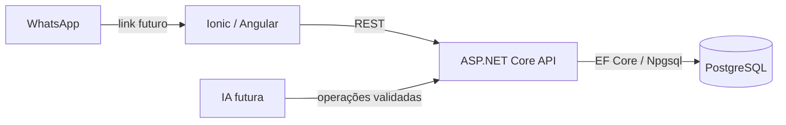

# Arquitetura

Monólito modular, com uma API ASP.NET Core, um frontend Ionic/Angular e PostgreSQL.

## Backend

Controllers expõem HTTP, DTOs definem contratos e Services serão introduzidos quando houver regras de negócio. O AppDbContext concentra o acesso ao banco. Configurações de entidades ficarão em Data/Configurations e migrations em Data/Migrations.

A Fase 2A adiciona AuthController, RolesController, DTOs de autenticação, serviços de login/bootstrap, políticas e validação JWT. Users e Roles são persistidos pelo AppDbContext. Não há repository genérico, múltiplos projetos de domínio, CQRS ou barramento.

Erros não tratados passam pelo exception handler e ProblemDetails. Respostas vazias de erro recebem ProblemDetails. Logs usam a infraestrutura do ASP.NET Core, sem habilitar dados sensíveis do EF.

## Frontend

Componentes standalone e carregamento de página por rota. Core contém serviços HTTP, contratos, sessão, guards e interceptor. Features agrupa página pública, autenticação e equipe; Shared será criado quando houver componentes reutilizáveis.

O serviço SystemApiService usa uma URL por ambiente e timeout de cinco segundos. A tela inicial trata conexão em andamento, sucesso e indisponibilidade, oferecendo nova tentativa.

Desenvolvimento usa origens distintas (8101 e 5080) com CORS restrito. Produção assume mesmo domínio e API em /api. CORS não substitui autenticação.

A Fase 2C mantém JWT em memória, sem persistência/refresh token. O interceptor limita o envio de credenciais à API configurada. Guards controlam a navegação; permissões são validadas também no backend. RouterOutlet Angular destrói páginas na navegação, evitando cache de dados administrativos entre sessões; contêineres de página mantêm a classe ion-page para o layout Ionic. Detalhes em [staff-frontend.md](staff-frontend.md).

## Evolução

Autenticação e autorização de funcionários já existem no backend. Cliente público e funcionário serão identidades distintas. Preços, permissões, status e totais serão definidos pelo backend. Integrações de IA ficarão atrás de contratos introduzidos quando esse módulo for implementado.

JWT foi introduzido na Fase 2A; gestão de usuários, na Fase 2B; login e administração no frontend, na Fase 2C. KDS, impressão, pagamentos e infraestrutura de produção seguem nas fases posteriores.

A Fase 3A introduz CategoriesController, DTOs, CategoryService, configuração EF e migration AddCategories, com páginas em features/catalog. catalog.manage separa administração de catálogo da gestão de funcionários. Não há novo repository nem camada adicional; regras e testes constam em [categories.md](categories.md).

A Fase 3B mantém esse padrão para Products, vinculados por FK a Categories. Preços usam decimal/numeric(8,2) com validação anterior à persistência. A disponibilidade efetiva é derivada no backend; a imagem é uma URL HTTPS opcional, sem serviço de upload neste incremento. Os seletores percorrem a lista paginada de categorias. Regras: [products.md](products.md).

A Fase 3C adiciona Ingredients no mesmo padrão, com unidade-base fixa, custo decimal, mínimo e fornecedor textual. Não há relação com Products até a implementação das fichas técnicas. Saldo e movimentos de estoque serão introduzidos na fase 6. Regras e arquivos: [ingredients.md](ingredients.md).

A Fase 3D liga Products e Ingredients por Recipes (uma por produto) e RecipeItems (composição ordenada). RecipeService valida e salva a composição completa em transação, serializando por produto e bloqueando os ingredientes durante a validação. A interface é acessada no produto e carrega os ingredientes de todas as páginas. Não adiciona bibliotecas, repositories, cálculo financeiro ou movimentação de estoque. Detalhes: [recipes.md](recipes.md).

A Fase 4A adiciona CustomersController, CustomerService, contratos, validação de telefone, configurações EF e páginas em features/customers. Customers e Addresses têm status independentes e escrita transacional. A permissão customers.manage inclui atendente; o catálogo continua exclusivo do administrador. A API não autentica clientes por telefone. Detalhes: [customers.md](customers.md).
